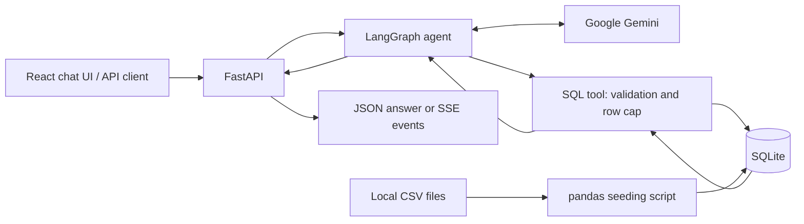

# Tactical Time-Machine

An AI football analytics application that answers natural-language questions using
Gemini, LangGraph, and a local SQLite database. The agent can request a SQL tool,
read its results, and explain the answer. FastAPI exposes both a JSON response
and a stream of tool activity and the final answer. A React chat interface shows
the conversation and live progress in the browser.

**Status:** Blocks 1–6 implemented as a local prototype. Persistent
conversations and deployment are still planned. No hosted demo is currently
provided; the deployment target is a $0 proof of concept with free-tier limits.

## What is implemented

- CSV ingestion in chunks, normalized table/column names, and query indexes.
- `agent_match_view`, which joins games with club names for score queries.
- A Gemini → SQL tool → Gemini loop orchestrated by LangGraph.
- Basic SQL validation, structured errors, and a maximum of 100 returned rows.
- Chat request validation and SSE events for tool calls, results, and answers.
- A responsive React chat UI with suggested questions, progress, cancellation,
  and error recovery. Answers are displayed as plain text.
- SQL-backed tables, numeric stat cards, and conservative category/value bar charts
  with Recharts. Empty, failed, and truncated query results are clearly labelled.
- Automated tests using synthetic SQLite data and mocked agent responses.

The application uses downloaded data; it does not fetch live scores. Answers
depend on the coverage and quality of the supplied dataset.

## Architecture and stack



| Layer | Technology |
| --- | --- |
| Language | Python, JavaScript/JSX, CSS, SQL |
| Frontend | React, Vite, Tailwind CSS |
| AI and orchestration | Google Gemini, LangChain, LangGraph |
| Data | pandas, SQLAlchemy, SQLite |
| API | FastAPI, Pydantic, Uvicorn |
| Transport | HTTP JSON and Server-Sent Events (SSE) |
| Tests | unittest, FastAPI TestClient / HTTPX, Node test runner, Playwright |

SQLite keeps the local data setup simple. `agent_match_view` reduces the joins
the model needs to generate. LangGraph makes the tool loop explicit. SSE fits
the current one-way delivery of progress and answers to a client.

## Local setup

Use Python 3.12 (the version used for local verification). Run these commands
from the project root after downloading or cloning the source:

```bash
python3.12 -m venv venv
source venv/bin/activate
python -m pip install -r requirements.txt
```

If `.env` does not already exist, copy `.env.example` to `.env`. On macOS/Linux,
the following command preserves an existing file:

```bash
cp -n .env.example .env
```

Edit `.env` locally:

| Variable | Purpose |
| --- | --- |
| `GEMINI_API_KEY` | Required for real agent requests; supply your own Google API key. |
| `GEMINI_MODEL` | Optional model override; the code defaults to `gemini-2.5-flash`. Choose a model available to your API project. |

Agent requests use Google's API and may incur usage charges. User messages and
tool results are sent to Gemini. `.env` is ignored by Git; `.env.example` contains
placeholders only.

### Prepare the football database

The raw CSVs and generated database are not distributed with the source. Download
the CSV archive from [Football Data from Transfermarkt on Kaggle](https://www.kaggle.com/datasets/davidcariboo/player-scores)
and extract the 12 CSVs into `data/`. Kaggle lists this dataset as CC0: Public
Domain. See [DATA_SOURCES.md](DATA_SOURCES.md) for attribution, expected filenames,
and version caveats. A fresh clone needs this separate data download for real
football queries; the automated tests run without it.

After placing the CSVs in `data/`, build the database:

```bash
python scripts/seed_db.py
```

This creates `football_vault.db`, indexes, and `agent_match_view`, and prints a
sample query. **Re-running the script replaces matching tables** in the existing
database; keep a backup if you have local changes. Expect substantial disk and
processing requirements for the full dataset.

### Start the server

```bash
python -m uvicorn src.api.main:app --reload --host 127.0.0.1 --port 8000
```

The API runs at `http://127.0.0.1:8000`. Interactive FastAPI documentation is
available at `http://127.0.0.1:8000/docs`. `/health` does not require a key or a
seeded database; football questions do.

### Start the frontend

Use Node.js 22.12+ (verified locally with 22.14) or another version supported
by `frontend/package.json`. Keep the API running and open a second terminal:

```bash
cd frontend
npm ci
npm run dev
```

Visit **http://localhost:5173**. Ask a full question, or choose a suggested one.
You should see progress followed by the final answer. Use Enter to submit and
Shift + Enter for a new line. Stop cancels the browser request; it does not
guarantee that an already-running backend/model operation is cancelled.

The API defaults to `http://127.0.0.1:8000`. To override it, copy
`frontend/.env.example` to `frontend/.env` and edit `VITE_API_BASE_URL`, then
restart Vite. **Frontend environment variables are public: never place a
Gemini key in them.** Keep the real key only in the root backend `.env`.

Use `localhost:5173` for the frontend because that exact origin is allowed by
the current API CORS configuration. Vite uses a strict port so a conflict
fails clearly rather than silently moving to an unauthorized origin.

The browser shows conversation history until the page reloads, but sends only
the latest question. Agent memory across turns remains Block 8. Block 6 now
displays SQL results alongside the answer. See [frontend/README.md](frontend/README.md)
for the component layout and streaming design.

## Try the backend

With the server running, use a second terminal:

```bash
curl --fail-with-body http://127.0.0.1:8000/health

curl --fail-with-body --request POST http://127.0.0.1:8000/chat \
  --header 'Content-Type: application/json' \
  --data '{"message":"How many matches are in the database?"}'

curl --no-buffer --fail-with-body --request POST http://127.0.0.1:8000/chat/stream \
  --header 'Content-Type: application/json' \
  --data '{"message":"How many matches are in the database?"}'
```

Example from a previously tested local snapshot (counts depend on your data):

```text
event: connected
data: {"message": "Agent started"}

event: tool_call
data: {"tools": ["execute_sql"]}

event: tool_result
data: {"tool_call_id":"example-count","tool":"execute_sql","result":{"columns":["matches"],"rows":[{"matches":86983}],"truncated":false}}

event: final_answer
data: {"answer": "There are 86,983 matches in the database."}

event: complete
data: {}
```

This is a terminal demo; no React frontend is needed. The stream delivers graph
updates, not individual answer tokens or private model reasoning. Tool selection,
query aliases, wording, and the number of tool calls may vary.

## API contract

| Endpoint | Behavior |
| --- | --- |
| `GET /health` | Returns `{"status":"ok"}`; checks HTTP liveness only. |
| `POST /chat` | Runs the graph and returns `{"answer":"..."}`. |
| `POST /chat/stream` | Runs the graph and returns `text/event-stream`. |

Both chat endpoints accept:

```json
{"message":"How many matches are in the database?"}
```

`message` must be a string of 1–2,000 characters. Invalid bodies receive HTTP
422. Whitespace-only strings are currently accepted. A failed `/chat` agent run
returns HTTP 502 with a generic message. A streaming failure after the response
starts is an SSE `error` event rather than a new HTTP status.

| SSE event | Data shape / meaning |
| --- | --- |
| `connected` | `{"message":"Agent started"}`; stream opened, not a dependency health check. |
| `tool_call` | `{"tools":["execute_sql"]}`; tools requested by Gemini. |
| `tool_result` | `{"tool_call_id":"...","tool":"execute_sql","result":{...}}`; result contains columns, rows, and truncated, or a sanitized error. One event per tool message. |
| `final_answer` | `{"answer":"..."}`; final model output. |
| `error` | `{"message":"..."}`; workflow failed; no `complete` follows. |
| `complete` | `{}`; workflow ended successfully, not a guarantee of answer correctness. |

Use `fetch()` with a streaming response reader for this POST endpoint; native
browser `EventSource` does not send this JSON POST request. Each SSE event ends
with a blank line. Parse the event's `data` JSON once; `result` is already an
object. This replaces Block 5's nested JSON-string contract: restart the backend
and refresh the frontend together. Local CORS permits `http://localhost:5173`.

Each request starts a new conversation. State is retained inside that graph run,
but no session history is saved between requests.

## Automated tests

Install the development dependencies and run:

```bash
python -m pip install -r requirements-dev.txt
python -m unittest discover -s tests -v
```

The tests use a temporary SQLite database with generated data and mocked graph
responses. They do not need a Gemini key, a local football dataset, or a running
server, and do not call Gemini. They cover SQL rejection, query errors and row
caps, API input validation, response handling, and SSE success/error sequences.
HTTP tests use [FastAPI's documented TestClient](https://fastapi.tiangolo.com/tutorial/testing/).
They do not measure model answer accuracy or network streaming latency.

Analyst prompt tests also verify that the schema, evidence rules, and response
guidance reach the model on initial and post-tool calls without altering message
history. These are wiring/regression tests, not proof of model compliance.
`tests/fixtures/analyst_review_cases.json` contains eight review scenarios and
acceptance criteria. Normal questions can be reviewed through the app; the two
`controlled_tool_result` cases require a controlled model-evaluation setup, not
pasting fake tool data into the user input. The file is a review checklist, not
an automated live evaluator. Live evaluation is opt-in and may consume API quota.

Frontend parser/API tests and production build:

```bash
cd frontend
npm ci
npm test
npm run build
```

Browser interaction tests (desktop and mobile viewports):

```bash
npx playwright install chromium
npm run test:e2e
```

Alternatively, with Google Chrome already installed, skip the download and use
`PLAYWRIGHT_CHANNEL=chrome npm run test:e2e`.

Browser tests start Vite automatically and mock the API responses. They test
submitting questions, preventing duplicate requests, recovery after errors,
interrupted streams, cancellation, text escaping, and responsive layout. No
Gemini calls or real football data are used. A live Gemini-backed browser
question is a separate manual integration check.

Block 5 was manually verified in Chrome by the project owner. For Block 6,
14 Python tests, 22 frontend unit tests, 16 desktop/mobile Chrome browser tests,
and the production build pass. Browser tests use mocked responses; live Gemini-backed Block 6 verification
is a separate manual check.

## Source layout

```text
scripts/seed_db.py       CSV import, indexes, and match view
src/agents/config.py    Gemini client configuration
src/agents/prompts.py   Analyst instructions and known schema
src/agents/graph.py     Agent/tool graph and message state
src/tools/db_tools.py   SQL validation, execution, and JSON formatting
src/api/main.py         HTTP endpoints and SSE formatting
tests/                  Offline SQL and API tests
frontend/src/           React UI, HTTP client, and SSE parser
frontend/tests/         Parser/API tests and browser interaction tests
main.py                 Terminal agent smoke test
DATA_SOURCES.md          Dataset provenance and preparation
```

## Roadmap

| Block | Scope | Status |
| --- | --- | --- |
| 1 | CSV seeding, SQLite indexes, match view | Implemented |
| 2 | Gemini client and LangGraph agent | Implemented |
| 3 | SQL tool and agent/tool loop | Implemented with basic guards |
| 4 | FastAPI JSON and SSE endpoints | Implemented prototype |
| 5 | React, Vite, and Tailwind chat UI | Implemented; automated browser checks use mocked responses |
| 6 | Tables, stat cards, and charts | Implemented; live-data review pending |
| 7 | Richer tactical commentary | Prompt and offline tests implemented; live answer-quality review pending |
| 8 | Persistent conversation memory | Planned |
| 9 | Explicit, bounded SQL correction/retry policy | Planned; tool errors already return to the model |
| 10 | Deployment and integration testing | Planned |

## Current limitations

- SQL protection uses keyword checks, not a SQL parser or a database-enforced
  read-only connection. There is no query timeout or table allowlist. The row
  cap limits returned data, not query execution cost.
- The API has no authentication or rate limiting. CORS is not authorization.
  SSE errors currently expose exception text. Keep this prototype local until
  those controls are implemented.
- The async streaming wrapper currently consumes a synchronous graph iterator,
  which can block other requests. Concurrency and backend cancellation need
  further work. Every tool message is now emitted separately.
- Schema instructions are a hand-maintained subset of the database. Missing
  data and model mistakes can still produce incomplete or incorrect answers.
- Python dependencies are not pinned yet. Frontend dependencies have exact
  versions and a committed npm lockfile. Python dependency locking and CI remain
  follow-up work.

## Data and licensing

Raw data, SQLite files, virtual environments, and real credentials are excluded
by `.gitignore`. See [DATA_SOURCES.md](DATA_SOURCES.md) for provenance and usage
status. No open-source license has been selected for the project code yet.
Dataset licensing must be established separately.

[ANALYSIS.md](ANALYSIS.md) is an archived, pre-implementation data assessment;
its old application-readiness statements are not the current project status.
