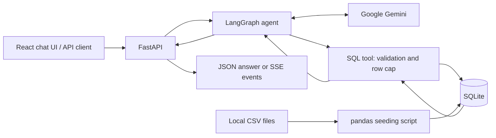

# Tactical Time-Machine

An AI football analytics application that answers natural-language questions using
Gemini, LangGraph, and a local SQLite database. The agent can request a SQL tool,
read its results, and explain the answer. FastAPI exposes both a JSON response
and a stream of tool activity and the final answer. A React chat interface shows
the conversation and live progress in the browser.

**Status:** Blocks 1–9 implemented as a local prototype, including bounded SQL correction and tab refresh
history restoration. Block 10 deployment configuration is prepared, not deployed. No hosted demo is currently
provided; the deployment target is a $0 proof of concept with free-tier limits.

## What is implemented

- CSV ingestion in chunks, normalized table/column names, and query indexes.
- `agent_match_view`, which joins games with club names for score queries.
- A Gemini → SQL tool → Gemini loop orchestrated by LangGraph.
- Basic SQL validation, structured errors, and a maximum of 100 returned rows.
- Chat request validation and SSE events for tool calls, results, and answers.
- A responsive React chat UI with suggested questions, progress, cancellation,
  and error recovery. Answers are displayed as plain text.
- SQL-backed tables, numeric stat cards, and conservative category/value bar charts
  with Recharts. Empty, failed, and truncated query results are clearly labelled.
- Automated tests using synthetic SQLite data and mocked agent responses.

The application uses downloaded data; it does not fetch live scores. Answers
depend on the coverage and quality of the supplied dataset.

## Architecture and stack



| Layer | Technology |
| --- | --- |
| Language | Python, JavaScript/JSX, CSS, SQL |
| Frontend | React, Vite, Tailwind CSS |
| AI and orchestration | Google Gemini, LangChain, LangGraph |
| Data | pandas, SQLAlchemy, SQLite |
| API | FastAPI, Pydantic, Uvicorn |
| Transport | HTTP JSON and Server-Sent Events (SSE) |
| Tests | unittest, FastAPI TestClient / HTTPX, Node test runner, Playwright |

SQLite keeps the local data setup simple. `agent_match_view` reduces the joins
the model needs to generate. LangGraph makes the tool loop explicit. SSE fits
the current one-way delivery of progress and answers to a client.

## Local setup

Use Python 3.12 (the version used for local verification). Run these commands
from the project root after downloading or cloning the source:

```bash
python3.12 -m venv venv
source venv/bin/activate
python -m pip install -r requirements.txt
```

If `.env` does not already exist, copy `.env.example` to `.env`. On macOS/Linux,
the following command preserves an existing file:

```bash
cp -n .env.example .env
```

Edit `.env` locally:

| Variable | Purpose |
| --- | --- |
| `GEMINI_API_KEY` | Required for real agent requests; supply your own Google API key. |
| `GEMINI_MODEL` | Optional model override; the code defaults to `gemini-2.5-flash`. Choose a model available to your API project. |
| `CORS_ALLOWED_ORIGINS` | Comma-separated exact frontend origins. Defaults to `http://localhost:5173`; an explicit value replaces that default. |

Agent requests use Google's API and may incur usage charges. User messages and
tool results are sent to Gemini. `.env` is ignored by Git; `.env.example` contains
placeholders only.

### Prepare the football database

The raw CSVs and generated database are not distributed with the source. Download
the CSV archive from [Football Data from Transfermarkt on Kaggle](https://www.kaggle.com/datasets/davidcariboo/player-scores)
and extract the 12 CSVs into `data/`. Kaggle lists this dataset as CC0: Public
Domain. See [DATA_SOURCES.md](DATA_SOURCES.md) for attribution, expected filenames,
and version caveats. A fresh clone needs this separate data download for real
football queries; the automated tests run without it.

After placing the CSVs in `data/`, build the database:

```bash
python scripts/seed_db.py
```

This creates `football_vault.db`, indexes, and `agent_match_view`, and prints a
sample query. **Re-running the script replaces matching tables** in the existing
database; keep a backup if you have local changes. Expect substantial disk and
processing requirements for the full dataset.

### Start the server

```bash
AUTH_MODE=local python -m uvicorn src.api.main:app --reload --host 127.0.0.1 --port 8000
```

The API runs at `http://127.0.0.1:8000`. Interactive FastAPI documentation is
available at `http://127.0.0.1:8000/docs`. `/health` does not require a key or a
seeded database; football questions do.

The explicit `local` mode is for loopback development only and bypasses public
auth/admission limits. Never expose it through a tunnel or public interface.
Without this override, invite-code access is required (see deployment
configuration below); missing settings fail closed.

### Start the frontend

Use Node.js 22.12+ (verified locally with 22.14) or another version supported
by `frontend/package.json`. Keep the API running and open a second terminal:

```bash
cd frontend
npm ci
VITE_AUTH_MODE=local npm run dev
```

Visit **http://localhost:5173**. Ask a full question, or choose a suggested one.
You should see progress followed by the final answer. Use Enter to submit and
Shift + Enter for a new line. Stop cancels the browser request; it does not
guarantee that an already-running backend/model operation is cancelled.

The API defaults to `http://127.0.0.1:8000`. To override it, copy
`frontend/.env.example` to `frontend/.env` and edit `VITE_API_BASE_URL`, then
restart Vite. **Frontend environment variables are public: never place a
Gemini key in them.** Keep the real key only in the root backend `.env`.

Use `localhost:5173` for the frontend because that exact origin is allowed by
the default API CORS configuration. Vite uses a strict port so a conflict
fails clearly rather than silently moving to an unauthorized origin.

The browser sends only the latest question plus a conversation UUID. The backend
restores recent context from SQLite checkpoints. Refresh reloads this tab's
saved messages and query results. New chat starts fresh without deleting old checkpoints. SQL results appear
alongside the answer. See [frontend/README.md](frontend/README.md)
for the component layout and streaming design.

## Try the backend

With the server running, use a second terminal:

```bash
curl --fail-with-body http://127.0.0.1:8000/health

curl --fail-with-body --request POST http://127.0.0.1:8000/chat \
  --header 'Content-Type: application/json' \
  --data '{"message":"How many matches are in the database?"}'

curl --no-buffer --fail-with-body --request POST http://127.0.0.1:8000/chat/stream \
  --header 'Content-Type: application/json' \
  --data '{"message":"How many matches are in the database?"}'
```

Example from a previously tested local snapshot (counts depend on your data):

```text
event: connected
data: {"message": "Agent started", "conversation_id": "9ac12a9b-d2df-4fce-bc53-c037f45b7626"}

event: tool_call
data: {"tools": ["execute_sql"]}

event: tool_result
data: {"tool_call_id":"example-count","tool":"execute_sql","result":{"columns":["matches"],"rows":[{"matches":86983}],"truncated":false}}

event: final_answer
data: {"answer": "There are 86,983 matches in the database."}

event: complete
data: {}
```

This is a terminal demo; no React frontend is needed. The stream delivers graph
updates, not individual answer tokens or private model reasoning. Tool selection,
query aliases, wording, and the number of tool calls may vary.

## API contract

| Endpoint | Behavior |
| --- | --- |
| `GET /health` | Returns `{"status":"ok"}`; checks HTTP liveness only. |
| `GET /conversations/{uuid}` | Returns a UI-safe projection of saved messages and SQL results without invoking Gemini. Unknown IDs return 404; busy threads return 409. |
| `POST /chat` | Runs the graph and returns `{"answer":"...","conversation_id":"..."}`. |
| `POST /chat/stream` | Runs the graph and returns `text/event-stream`. |

Both chat endpoints accept:

```json
{"message":"How many matches are in the database?","conversation_id":"9ac12a9b-d2df-4fce-bc53-c037f45b7626"}
```

`message` must be a string of 1–2,000 characters. Invalid bodies receive HTTP
422. Whitespace-only strings and malformed conversation UUIDs are rejected.
The conversation ID is optional: omission generates a fresh UUID, and an unknown
valid UUID starts a new thread. Reuse the returned ID for follow-ups. A failed `/chat` agent run
returns HTTP 502 with a generic message. A streaming failure after the response
starts is an SSE `error` event rather than a new HTTP status. Concurrent requests
for the same conversation receive HTTP 409 before a response stream starts.
An oversized/invalid current exchange returns HTTP 413 on `/chat` or an SSE
`error` with `code: "context_limit"` on `/chat/stream`; start fresh or narrow the question.

| SSE event | Data shape / meaning |
| --- | --- |
| `connected` | `{"message":"Agent started","conversation_id":"..."}`; resolved thread ID, not a dependency health check. |
| `tool_call` | `{"tools":["execute_sql"]}`; tools requested by Gemini. |
| `tool_result` | `{"tool_call_id":"...","tool":"execute_sql","result":{...}}`; result contains columns, rows, and truncated, or a sanitized error. One event per tool message. |
| `final_answer` | `{"answer":"..."}`; final model output. |
| `error` | `{"message":"..."}`; workflow failed; no `complete` follows. |
| `complete` | `{}`; workflow ended successfully, not a guarantee of answer correctness. |

Use `fetch()` with a streaming response reader for this POST endpoint; native
browser `EventSource` does not send this JSON POST request. Each SSE event ends
with a blank line. Parse the event's `data` JSON once; `result` is already an
object. This replaces Block 5's nested JSON-string contract: restart the backend
and refresh the frontend together. Default local CORS permits `http://localhost:5173`.

### Conversation memory (local prototype)

API startup opens a LangGraph async SQLite saver at `conversation_memory.db` by default,
separate from football data. The saver closes on shutdown; the file and its
SQLite sidecars are ignored by Git. Checkpoints include user messages, model
messages and tool results. They survive a backend restart when the client reuses
the same conversation ID. The terminal smoke test remains nonpersistent.

Run exactly **one backend worker/process** against this prototype. An in-process
guard serializes each conversation by rejecting overlap (409); it does not
coordinate multiple workers. Graph/model execution and checkpoint access are
asynchronous; SQL tools may still finish work already dispatched to a thread
after cancellation. No automatic HTTP retries or request deduplication are added.

`AGENT_CONTEXT_MAX_CHARS` defaults to 64000. This is an approximate serialized
character budget, **not** a Gemini token count. The model receives the system
prompt, the current complete tool exchange, and a recent contiguous suffix of
complete turns; 8000 characters are reserved for tool/schema overhead. An older
interrupted turn ends that suffix. Oversized current exchanges fail explicitly
rather than splitting tool-call/result pairs. Stored history is not trimmed;
checkpoint size grows until a separate retention/deletion policy is implemented.

The frontend saves only its active UUID in `sessionStorage`, not message bodies.
Refresh restores this tab's history through `GET /conversations/{uuid}` before
enabling the composer. The endpoint uses the same busy guard as chat writes and
returns `Cache-Control: no-store`. It projects user text, final assistant text,
structured query results, and incomplete-response status; raw graph metadata,
system messages, intermediate tool-call arguments and thinking blocks are excluded.
Missing history starts a new chat with an explanation. Network/storage failures
leave input blocked with Retry and New chat options; they never silently reuse
unseen context. A still-running chat may return 409 until its operation stops.

New chat clears the screen/draft and replaces the stored ID; it does not delete
old checkpoints and is disabled during an active chat request. It can cancel a
pending history load. Storage-disabled browsers can chat but show a warning that
refresh restoration is unavailable. Session storage is tab-scoped; a duplicated
tab may inherit its ID, so the backend busy guard remains necessary. There is no
saved-chat list, cross-device history, pagination, or deletion interface yet.

**Privacy:** conversation IDs are not authentication. In invite mode, the
backend verifies a shared code and a random browser session secret, so
another session cannot read or append to the same saved thread. Explicit local
mode has no authentication and must stay private. Checkpoints are not encrypted;
don't submit sensitive information. Retention/deletion and hosted access review
remain pre-launch tasks.

## Automated tests

Install the development dependencies and run:

```bash
python -m pip install -r requirements-dev.txt
python -m unittest discover -s tests -v
```

The tests use a temporary SQLite database with generated data and mocked graph
responses. They do not need a Gemini key, a local football dataset, or a running
server, and do not call Gemini. They cover SQL rejection, query errors and row
caps, API input validation, response handling, and SSE success/error sequences.
HTTP tests use [FastAPI's documented TestClient](https://fastapi.tiangolo.com/tutorial/testing/).
They do not measure model answer accuracy or network streaming latency.

Analyst prompt tests also verify that the schema, evidence rules, and response
guidance reach the model on initial and post-tool calls without altering message
history. These are wiring/regression tests, not proof of model compliance.
`tests/fixtures/analyst_review_cases.json` contains eight review scenarios and
acceptance criteria. Normal questions can be reviewed through the app; the two
`controlled_tool_result` cases require a controlled model-evaluation setup, not
pasting fake tool data into the user input. The file is a review checklist, not
an automated live evaluator. Live evaluation is opt-in and may consume API quota.

Frontend parser/API tests and production build:

```bash
cd frontend
npm ci
npm test
npm run build
```

Browser interaction tests (desktop and mobile viewports):

```bash
npx playwright install chromium
npm run test:e2e
```

Alternatively, with Google Chrome already installed, skip the download and use
`PLAYWRIGHT_CHANNEL=chrome npm run test:e2e`.

Browser tests start Vite automatically and mock the API responses. They test
submitting questions, preventing duplicate requests, recovery after errors,
interrupted streams, cancellation, text escaping, and responsive layout. No
Gemini calls or real football data are used. A live Gemini-backed browser
question is a separate manual integration check.

Block 5 was manually verified in Chrome by the project owner. Automated memory
tests use actual temporary SQLite checkpoints and mocked model responses to check
reopen/restart persistence, isolation, tool evidence, context selection and busy
guard cleanup. Browser tests mock HTTP responses. Live Gemini follow-up quality
remains a separate manual check: ask for a team's five recent matches, then ask
"How many of those did they win?" without repeating the team.

Current verification: 89 Python tests, 32 frontend unit tests, and the frontend
production build passed without live Gemini calls. Previous verification included
24 desktop/mobile Chrome browser tests.
The current Chrome run was blocked by sandbox permissions and escalation was
declined, so browser regression and hosted invite-code entry remain unverified.
The Python suite emits an existing TestClient/httpx deprecation
warning; migrating that test dependency is separate from conversation memory.

## Source layout

```text
scripts/seed_db.py       CSV import, indexes, and match view
src/agents/config.py    Gemini client configuration
src/agents/prompts.py   Analyst instructions and known schema
src/agents/graph.py     Agent/tool graph and message state
src/agents/memory.py    Persistent checkpoint connection lifecycle
src/agents/context.py   Tool-safe bounded model context
src/agents/history.py   UI-safe checkpoint history projection
src/agents/sql_retry.py Deterministic SQL correction budget and terminal responses
src/tools/db_tools.py   SQL validation, execution, and JSON formatting
src/api/main.py         HTTP endpoints and SSE formatting
tests/                  Offline SQL and API tests
frontend/src/           React UI, HTTP client, and SSE parser
frontend/tests/         Parser/API tests and browser interaction tests
main.py                 Terminal agent smoke test
DATA_SOURCES.md          Dataset provenance and preparation
```

## Roadmap

| Block | Scope | Status |
| --- | --- | --- |
| 1 | CSV seeding, SQLite indexes, match view | Implemented |
| 2 | Gemini client and LangGraph agent | Implemented |
| 3 | SQL tool and agent/tool loop | Implemented with basic guards |
| 4 | FastAPI JSON and SSE endpoints | Implemented prototype |
| 5 | React, Vite, and Tailwind chat UI | Implemented; automated browser checks use mocked responses |
| 6 | Tables, stat cards, and charts | Implemented; live-data review pending |
| 7 | Richer tactical commentary | Prompt and offline tests implemented; live answer-quality review pending |
| 8 | Persistent conversation memory | Agent memory and tab-refresh history restoration implemented; live review pending |
| 9 | Explicit, bounded SQL correction/retry policy | Implemented; simulated-model and real SQLite recovery tested |
| 10 | Deployment and integration testing | Deployment templates, invite safeguards, artifact preparation, and offline integration tests implemented; artifact publication, cloud deployment, and hosted verification pending |

## Deployment plan

### Remaining launch steps (8–10)

The repository now includes `render.yaml`, `frontend/vercel.json`, hosted build
validation, and `scripts/check_deployment.py`. These files do not create cloud
resources. There is no live URL yet, and no account's billing status has been
verified. Do not treat this as a completed deployment.

**$0 launch gate:** use Vercel Hobby and Render Free without paid add-ons or a
payment method that permits billed excess usage. Keep Gemini on a project with
paid billing disabled. If any provider requires a paid plan or payment setup,
stop rather than proceeding. Free-plan service suspension is acceptable; paid
fallback is not. Code cannot enforce billing settings in external accounts.

1. **Publish the prepared database artifact.** After reviewing redistribution
   terms, upload `build/football-artifact/football_vault.db.gz` and `manifest.json`
   to a release in your personal repository. Use its versioned HTTPS asset URL
   and the manifest's `artifact_sha256`. Do not commit databases into Git. This
   upload has not been performed.
2. **Prepare the frontend project on Vercel Hobby.** Select this repository,
   root directory `frontend`, and Node 22.x compatible with `package.json`.
   Reserve/note the project URL before configuring backend CORS. Do not deploy
   with a placeholder backend URL; the final build needs the real value.
3. **Create the Render service from `render.yaml`.** Check that the dashboard
   shows Free before confirming. It creates no paid disk/database. Supply the
   artifact URL/hash, exact frontend origin, private invitation code, and Gemini
   key in backend environment settings. Never paste real secrets into YAML.
   `DEMO_CHAT_ENABLED` starts false; automatic backend deploys are off. The
   hosted start command requires invite mode.
4. **Connect and deploy the frontend.** Set `VITE_API_BASE_URL` to the real
   `https://<backend>.onrender.com` origin. `frontend/vercel.json` builds static
   files only; `build:hosted` rejects missing/non-HTTPS URLs, a local bypass, and
   secret-like `VITE_` environment variables. Do not add the invitation code or
   Gemini key to frontend settings. Disable unnecessary preview deployments in
   the dashboard to conserve build quota.
5. **Run hosted checks with live chat still off.** From the local development
   environment (HTTPX comes from `requirements-dev.txt`), run:

   ```bash
   python -m scripts.check_deployment \
     --backend https://YOUR-BACKEND.onrender.com \
     --frontend https://YOUR-FRONTEND.vercel.app \
     --check-access
   ```

   The code is prompted privately, not passed on the command line. Checks cover
   liveness, frontend reachability, rejected anonymous chat, CORS, and invitation
   access. No valid model question is submitted, and redirects are not followed.
   It does not certify billing settings, database correctness, or live SSE. A
   sleeping backend may need time to wake before rerunning.
6. **Verify the real flow manually.** After confirming Gemini Free/no paid billing,
   enable `DEMO_CHAT_ENABLED=true` and restart the backend. Enter the code in a
   browser, ask for the match count, check streamed results, ask a follow-up,
   refresh, and try a separate browser session. Test leaving/re-entering, wrong
   codes, limit messages, and history loss. Check hosting usage dashboards after
   testing. Do not keep probing limits with real Gemini calls; offline tests
   already cover rejection. Set chat back to false whenever the demo is not needed.
7. **Finish the portfolio handoff.** Only after verification, add the actual live
   URL and current screenshots to this README, labelled “invite-only demo—access
   available on request.” Never include the code in screenshots. Explain cold
   starts, temporary chat history, static dataset coverage, and free quotas. Do
   not claim production readiness. No URL or screenshot has been fabricated here.

Local integration tests exercise invite access → API → graph → read-only SQLite
→ SSE → checkpoint history, with Gemini mocked. Hosted/browser testing and clean
Linux installation are still required. Earlier Chrome execution was blocked;
no additional browser permission was requested in this step.

The configuration follows [Render's Blueprint reference](https://render.com/docs/blueprint-spec)
and [Vercel's static configuration](https://vercel.com/docs/project-configuration/vercel-json).
Vercel's account plan is selected in its dashboard, not enforced by `vercel.json`.

Hosting selection reviewed on **2026-10-04**. This is a deployment target, not
a running deployment or a guarantee of zero cost. No cloud resources have been
created. Account eligibility, available quota, and runtime capacity still need
verification before launch.

| Component | Selected target | Reason |
| --- | --- | --- |
| React frontend | Vercel Hobby, static Vite build | Fits this personal, non-commercial portfolio demo; serves `frontend/dist`. |
| FastAPI backend | Render Free web service, one worker | Keeps the existing Python process and SQLite architecture; browser calls this service directly for JSON and SSE. |
| Model API | Existing Gemini integration, free-tier project where eligible | Avoids changing the agent; confirm the configured model's availability and project quota before launch. |

### Free-tier constraints

- **Vercel:** Hobby is limited to personal, non-commercial use. Its documented
  included usage currently includes 100 GB fast data transfer and one million
  CDN requests. See the [Hobby plan limits](https://vercel.com/docs/plans/hobby).
- **Render:** Free services sleep after 15 idle minutes; waking takes about a
  minute. The workspace shares 750 free instance hours per month. Runtime file
  changes are lost on restarts, redeploys, and idle shutdowns, and free services
  cannot attach persistent disks. Bandwidth/build allowances also apply; with
  a payment method, excess usage can incur charges. Without one, services or
  builds can be suspended instead. See [Render's free-service limits](https://render.com/docs/free).
- **Gemini:** Check [model pricing](https://ai.google.dev/gemini-api/docs/pricing)
  and the project's active limits in AI Studio, as described in the
  [rate-limit documentation](https://ai.google.dev/gemini-api/docs/rate-limits).
  Do not assume an existing key is on a free tier. One football question can
  make multiple model requests, especially during SQL correction.

### Decisions to resolve before deployment

- **Football data (Step 5):** the current local database is approximately 1 GB
  and is not tracked in Git. A deployment needs a reproducible data artifact
  included in the build or retrieved during provisioning. Evaluate a smaller,
  clearly labelled demo snapshot and measure resource usage; Step 5 below now
  provides a compact all-row artifact, but free-tier capacity has not been tested.
  Do not upload the full database to Git or seed the full
  CSV collection on every application startup.
- **Chat storage (Step 6):** Render Free would make `conversation_memory.db`
  temporary. Confirm acceptance of history loss and disclose it in the UI, or
  revise the storage design before promising durable history. This does not
  change local checkpoint persistence.
- **Public access (Step 7):** Invite verification, session-scoped conversations,
  admission limits, and SQL protections are implemented. Provider configuration,
  two-session live verification, and privacy/retention review remain launch
  prerequisites. CORS alone is not security. Keep the application local for now.
- **Cost controls:** use provider subdomains, avoid paid upgrades/add-ons, and
  verify account billing settings before creating resources. Stop or restrict
  the demo when free quota is exhausted rather than automatically upgrading.
- **Hosted verification (Step 9):** test cold starts, SSE delivery, database
  resource usage, and restart behaviour on the selected services. Hosting
  selection alone does not establish compatibility under real traffic.

### Production URL configuration

Step 2 makes the allowed frontend origins configurable. Local defaults remain
unchanged. Once real hosting URLs exist, replace these example addresses:

| Where to set the variable | Variable | Example value |
| --- | --- | --- |
| Backend environment (Render) | `CORS_ALLOWED_ORIGINS` | `https://your-frontend.vercel.app` |
| Frontend build environment (Vercel) | `VITE_API_BASE_URL` | `https://your-backend.onrender.com` |

The frontend already reads `VITE_API_BASE_URL` for both streaming chat and saved
history requests. Vite embeds it at build time: rebuild/redeploy the frontend
after changing it. If omitted, it falls back to the local API, so it must be set
for the hosted demo. Never put secrets in `VITE_` variables.

The backend reads `CORS_ALLOWED_ORIGINS` when the application is imported;
restart/redeploy after editing it. Multiple origins are comma-separated. An
explicit list replaces the local default rather than adding to it. Use exact
HTTP(S) origins with no paths or trailing slashes; blank entries, wildcards,
credentials, and malformed ports fail early. Use HTTPS for hosted URLs. Preview
deployments need their exact frontend origin explicitly allowed, not a wildcard.

CORS controls browser access to responses; it does not authenticate requests or
block non-browser clients. Public-access protections remain a later step.
No real environment files or hosting settings have been changed.

### Backend secrets

Step 3 code preparation is implemented; the hosted secret has **not** been set.
When creating the backend service, set `GEMINI_API_KEY` privately in its hosting
environment settings. Do not paste it into GitHub, chat, screenshots, frontend
settings, or deployment configuration files. Keep `.env.example` as a template
and do not upload the real `.env` file.

The client factory reads the backend environment. Local `.env` loading does not
override an existing environment variable. Missing, whitespace-only, and example
placeholder keys are rejected before constructing the model client, with an error
that does not include the key. This validates configuration presence, not whether
Google accepts the key or whether the project has quota. Validation happens when
the model client is requested; `/health` remains a liveness check, not a key check.

The frontend needs only the public `VITE_API_BASE_URL`, never `GEMINI_API_KEY` or
`VITE_GEMINI_API_KEY`. Restart/redeploy the backend after setting or rotating a key.
If a key is ever exposed, revoke it at the provider and replace it; deleting it
from the latest commit does not remove it from Git history.

Secret environment files are already ignored by Git. Ignore rules do not protect
files previously committed; do not force-add them. No real secrets were read or
modified for this step. Actual hosted configuration is pending service creation.

### Backend packaging and startup

Step 4 prepares a native Python deployment; Docker is not required. These are
settings for the later service-creation step, not an instruction to launch yet:

| Render setting | Value |
| --- | --- |
| Runtime | Python |
| Root directory | Repository root (leave blank) |
| Build command | `python -m pip install -r requirements-runtime.txt` |
| Start command | `python -m src.api.serve` |
| Health check path | `/health` (HTTP liveness only) |
| Instance type | Free |

The `.python-version` file selects Python 3.12; Render selects its latest
available patch release. Local verification uses 3.12.8, so a clean hosted build
still needs verification. See [Render Python versions](https://render.com/docs/python-version)
and [FastAPI deployment](https://render.com/docs/deploy-fastapi).

`src/api/serve.py` binds to `0.0.0.0` so the hosting network can reach it. It reads
Render's `PORT` environment variable (default 8000), rejects invalid ports,
disables development reload, and explicitly runs one worker. HTTP access logging
is disabled to avoid logging conversation IDs in request paths; server/error
logs remain enabled. Hosting proxies may have their own logging policies.
Use the existing loopback/reload command for local development instead.

`requirements-runtime.txt` pins direct server dependencies to installed, locally
tested versions. `requirements.txt` includes those plus pandas for local CSV
seeding; development dependencies still include the full local requirements.
Transitive dependencies are not fully locked, and a clean Linux installation
has not yet been verified. No packages were upgraded as part of this change.

Startup does not download or seed data. The football database still needs
provisioning in Step 5, chat storage decisions in Step 6, and public-access
protections in Step 7. A successful `/health` response alone does not mean the
database or Gemini is ready. Nothing has been deployed.

### Football database artifact

Step 5 adds a reproducible packaging recipe and checksum-verified installation.
The generated files remain local and Git-ignored; no artifact has been uploaded.
The current local database is unchanged, and the app still uses it.

From the repository root, prepare an artifact using Python's standard library:

```bash
python -m scripts.prepare_football_db
```

This reads `football_vault.db` in read-only mode and writes a new directory:

```text
build/football-artifact/
  football_vault.db       Compact database
  football_vault.db.gz    Uploadable compressed artifact
  manifest.json          Checksums, byte sizes, columns, row counts, match dates
```

The locally generated artifact is **215,232,512 bytes (205.3 MiB)** expanded and
**56,086,147 bytes (53.5 MiB)** compressed, retaining 86,983 games. Recorded match
dates span 2006-06-09 through 2026-03-25; this range does not imply complete
coverage of every competition or season. Sizes and counts describe this local
snapshot only.

All rows from the six tables in the agent schema are retained. Only documented
columns and the club IDs required by `agent_match_view` are included. The script
recreates lookup indexes and the match view; unused source tables and columns
are excluded. There is no date/team sampling, and existing missing data is not
repaired. Conversation checkpoints, credentials, and unrelated files are never
included. The manifest describes actual snapshot coverage; a different source
release can produce different results. See [DATA_SOURCES.md](DATA_SOURCES.md).

The output directory must not already exist. For another run, choose a new
`--output build/football-artifact-v2` instead of overwriting the first artifact.
If generation fails, partial output may remain there; it is not a valid release
unless the manifest was successfully written and verification completed.

Before deployment, publish the gzip and manifest to an approved artifact host
(for example, a manually created GitHub Release). This is a separate external
write and has not been performed. Review dataset redistribution terms first.
Copy the immutable artifact's HTTPS URL and its `artifact_sha256` into the backend
build environment as `FOOTBALL_DB_URL` and `FOOTBALL_DB_SHA256`. No credentials
should appear in a URL; public artifact downloads are the intended demo path.

Once those values are configured, the **complete backend build command** becomes:

```bash
python -m pip install -r requirements-runtime.txt && python -m scripts.install_football_db
```

The installer reads process environment variables, not `.env`. It downloads with
a network timeout and a 256 MiB compressed size limit, checks SHA-256 before
decompression, limits the expanded database to 1 GiB, then validates SQLite
integrity, required columns, nonempty games, and the view. It stages the file
before publishing it at `football_vault.db` and refuses to replace existing data.
Builds should use a clean checkout. A checksum pins trusted release bytes; it
does not establish dataset licensing or turn arbitrary SQLite files into trusted
inputs. Do not use artifacts from untrusted publishers.

For an offline test, pass `--artifact <local-gzip-path> --sha256 <artifact-sha256>
--destination <new-database-path>`. Do not target your existing local database.
Only the build provisions data; server startup does not reseed or download it.
The provisioned football database is part of the deployment build, while chat
checkpoints are runtime writes with the separate storage limitations in Step 6.

Hosted download, build capacity, and query performance still need verification.
### Conversation storage on the free demo

Step 6 prepares **temporary server-side SQLite history** for the $0 demo. This
keeps the current checkpointer without adding a paid disk or another database
service. It is a deliberate demo limitation, not durable hosted storage. Local
history continues to persist normally while its database file is retained.

Set this backend environment variable when creating the Render service:

```dotenv
CONVERSATION_DB_PATH=runtime/conversation_memory.db
```

Relative paths resolve from the project root, independent of the working
directory. Absolute paths are also supported for a future persistent mount.
The parent directory is created on startup. Omitting the variable preserves the
existing root-level `conversation_memory.db`. Empty values, directory paths,
and the main football database path are rejected. Changing paths does not
migrate or delete previous chats: a new file means a new history store.

No checkpoint file is packaged with the football artifact. `runtime/`, SQLite
files, and their sidecars remain Git-ignored. Only one backend worker is
supported. Choosing a different path does not make Render Free storage durable.

While the server retains the file, follow-ups and tab-refresh restoration work
as before. After an idle shutdown, restart, or redeploy loses that runtime file,
the browser may still remember its conversation ID but the server no longer has
the messages. Existing history loading handles a 404 by explaining that the chat
was not found and starting a new conversation. Without a refresh, old bubbles
can remain visible locally even though a later follow-up has no saved server
context; repeat the relevant details or start a new chat. Automatic detection of
this mid-session reset is not implemented.

The composer now warns that free-hosted history may disappear and advises users
not to enter sensitive information. Temporary storage is not guaranteed timely
deletion: no retention schedule, deletion endpoint, backup, or ownership controls
have been added. Access controls remain required before public launch. No live
checkpoint file or hosting configuration was changed for this step.

### Invite-only access and zero-dollar operating policy

Step 7 uses one **shared invitation code**. There are no user accounts, Supabase,
Google OAuth, or authentication-service fees. Give the demo URL and code privately
to someone who requests access. The code is reusable, not a single-use invitation.

Set `AUTH_MODE=invite` (the default) and a randomly generated `DEMO_ACCESS_CODE`
of at least 24 characters in the backend environment. Generate one locally with
`python -c 'import secrets; print(secrets.token_urlsafe(32))'`, then keep it out
of Git and screenshots. No actual code has been generated or stored by this task.
Never put the code in a `VITE_` variable; visitors enter it in the password field.

React verifies the code through `GET /access` before displaying chat. Every chat
and history request sends the code as a Bearer credential plus a cryptographically
random 32-byte browser secret in `X-Demo-Session`. Both stay in tab-scoped
sessionStorage. Checkpoint IDs are derived from that secret and the invitation
code, not just the visible conversation UUID. Another browser with the shared
code cannot read existing chats without also obtaining their session secret.
This is possession-based isolation, not verified identity or individual accounts.

Leave demo clears access from the tab and aborts active browser requests; it does
not delete checkpoints or revoke copies of the code. Rotating the backend code
revokes the old code for everyone and makes previous session namespaces
inaccessible. There is no per-person revocation, cross-device history, or expiry.
The code can be forwarded, so share sparingly. Always use HTTPS when hosted.
`/health` and CORS preflights are public; other routes require invite access.
Session storage must be available to enter the hosted demo.

#### Demo limits and cost boundaries

Invite-mode limits are deliberately small and reject excess work with 429.
Here, “user” means browser session; a code-holder can create another session,
so the global cap is the main usage control:

| Limit | Value |
| --- | --- |
| Incoming protected requests, before token verification | 60/minute globally |
| Verified requests per user, including history | 30/minute |
| Chat submissions per user | 2/minute and 10/day |
| Chat submissions across all users | 30/day |
| Concurrent chat requests | 1/user, 2 globally |
| Concurrent protected requests, including auth checks | 4 globally |
| Request body / total request deadline | 16 KiB / 90 seconds |
| Model request timeout / output cap | 30 seconds / 2,048 tokens |

Attempts, including failures, consume admission allowance. These fixed-window
counters live in one process and reset on restart; they are not durable billing
limits or DDoS protection. Provider/platform quota is the final cost boundary.
The client disables model transport retries; bounded SQL correction can still
make several Gemini calls per admitted question. Cancellation/timeouts do not
guarantee a remote provider immediately stops work already received.

The SQL tool now opens SQLite with `mode=ro`, uses `query_only`, authorizes only
the known football tables and a limited set of SQL functions, caps SQL/value
lengths, and interrupts execution after approximately five seconds via SQLite's
progress callback. It still caps returned rows at 100. These are safeguards,
not a strict memory sandbox or a guarantee that every query fits Render Free.

Keep `DEMO_CHAT_ENABLED=false` until you verify all of the following yourself:
Vercel **Hobby**, Render **Free** with no paid add-ons or
automatic billed excess usage, and a Gemini API project on the **Free tier
without paid billing enabled**. Then set it to `true` on the backend to allow
authenticated model requests. If free quota is unavailable, keep chat disabled;
do not fall back to a billed project. Budget alerts alone are not spending caps.
Code cannot inspect or guarantee an account's billing status. No upgrade,
payment method, or paid fallback is configured by this application.

Before sharing the hosted demo, test code entry/rotation, two-browser isolation,
SSE cancellation, quota rejection, and the hosted SQL workload; review privacy
information and a chat deletion process.
Retention and self-service deletion are not implemented. Next: publish and
connect the services (Step 8), only after these setup prerequisites are met.

## Current limitations

### SQL correction policy

`src/agents/sql_retry.py` replaces the unrestricted tool-node loop with sequential,
budgeted tool execution. Each user question allows at most two correction
executions and eight tool executions total, including calls in the same model
response. Counts are reconstructed from the current turn's messages, so they
survive checkpoints but reset for a new user question. A query immediately after
a retryable failure consumes a correction even when it succeeds. Independent
successful queries do not consume corrections; success does not replenish the
question's spent budget.

The SQL tool returns `error_code` and `retryable` with failures. Recognized SQLite
syntax, column/alias, unsupported-function and aggregate errors can be corrected.
Unknown table names can be corrected against the documented schema; a missing
known table indicates incomplete setup and stops. Missing database files no
longer cause the query tool to create an empty SQLite database. Locked/unavailable
databases, unknown tool failures, and all validation rejections stop immediately.
Multi-statement queries remain rejected rather than being automatically split.
No safety check is relaxed during correction.

A previously failed query repeated with only unquoted case/whitespace or trailing
semicolon changes stops before database access. This is conservative fingerprinting,
not semantic SQL equivalence. Every requested call still receives a ToolMessage,
including calls skipped after a limit, keeping memory context structurally valid.
The `sql_stop` node writes a deterministic explanation without another Gemini
call. The API emits it as a final answer, so it is also restored from history.
Earlier query results remain visible as individual outputs, not a completed
analysis. Empty result sets are successful execution, not retry failures.

Retries fix execution mistakes, not incorrect football interpretations. Model
service failures are not retried. SQL execution now has a progress-based timeout;
the graph's general recursion limit remains a separate last-resort bound.

### Other limitations

- SQL protections include SQLite-enforced read-only access, a table/function
  allowlist, and a progress-based deadline. This is not a strict memory sandbox;
  some otherwise valid SQL functions are intentionally unavailable.
- Invite access and process-local admission limits are implemented, but hosted
  access verification, regression, retention/deletion, and account
  billing checks remain pending. CORS is not authorization.
- The API supports a single worker, not distributed conversation coordination.
  Cancellation cannot guarantee termination of an already-running SQL thread or
  remote model operation. Every tool message is emitted separately.
- Schema instructions are a hand-maintained subset of the database. Missing
  data and model mistakes can still produce incomplete or incorrect answers.
- Direct Python dependencies are pinned, but transitive dependency locking and
  clean Linux installation verification remain follow-up work. Frontend
  dependencies have exact versions and a committed npm lockfile. CI remains
  follow-up work.

## Data and licensing

Raw data, SQLite files, virtual environments, and real credentials are excluded
by `.gitignore`. See [DATA_SOURCES.md](DATA_SOURCES.md) for provenance and usage
status. No open-source license has been selected for the project code yet.
Dataset licensing must be established separately.

[ANALYSIS.md](ANALYSIS.md) is an archived, pre-implementation data assessment;
its old application-readiness statements are not the current project status.
